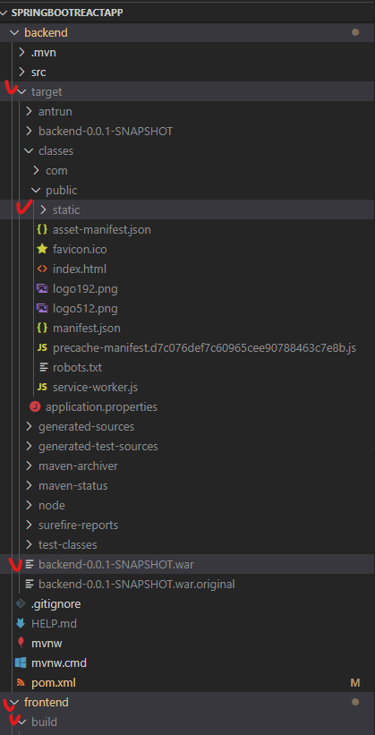
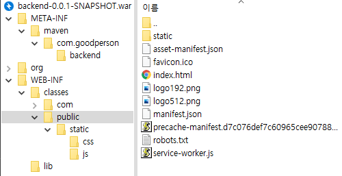
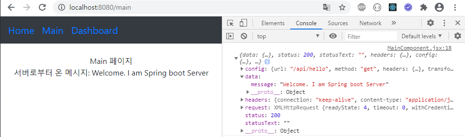
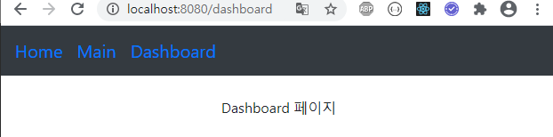

# Spring Boot와 React.js 연동하기

빌드 시 Spring과 React.js가 동시에 빌드되어 같은 포트로 동작하도록 하는 것이 이 프로젝트의 목표입니다.<br>

## 참고 사이트
* https://lemontia.tistory.com/912
* https://sundries-in-myidea.tistory.com/71

## 프론트엔드 작성

### React.js 프로젝트 생성
```bash
# 프로젝트 생성 및 실행
mkdir SpringBootReactApp # root directory
cd SpringBootReactApp
npx create-react-app frontend
cd frontend
npm start

# 필요한 모듈 설치
npm install bootstrap react-bootstrap --save # 부트스트랩 모듈
npm install react-router-dom --save # 라우터 모듈
npm install axios --save # 서버와 통신하기 위한 모듈
npm install maven # 메이븐 
```

### 프록시 설정
빌드한 뒤 서버를 실행하면 프론트, 백엔드는 같은 포트로 동작하지만, <br>
개발 시 React Dev Server(port: 3000), Spring Server(port: 8080)로 포트가 나뉘어 실행되기 때문에,<br>
CORS를 방지하기 위해 
[프록시](https://github.com/hch0821/React.js-Example/tree/master/j.proxy) 설정이 필요합니다.<br><br>

#### frontend/Package.json에 다음 한 줄 추가
```json
"proxy":"http://localhost:8080
```

### 프로젝트 코드
프론트엔드 코드는 [여기](./frontend/src) 참고

## 백엔드 작성
### 프로젝트 생성
* https://start.spring.io/ 에서 Packaging을 War로 설정하고 필요한 Dependencies를 추가하고 Generate 클릭

### 프로젝트 코드
#### controller/ApiController.java
```java
@RestController
public class ApiController {
    @GetMapping("/api/hello")
    public Map<String, Object> hello() {
        Map<String, Object> map = new HashMap<>();
        map.put("message", "Welcome. I am Spring boot Server");
        return map;
    }
}
```
#### controller/WebController.java
```java
@Controller
public class WebController implements ErrorController  {
    // 백엔드에서 React.js 라우터에 있는 주소로 주소를 임의 변경하면,
    // 매핑되는 주소가 없으므로 404 오류가 생긴다.
    // 이를 방지하기 위해 에러가 발생하면 프론트엔드에서 작성한 frontend/src/index.html을 전송한다.
    @GetMapping({ "/", "/error" })
    public String index() {
        return "index.html";
    }

    /*400에러 발생 시 getErrorPath() 호출*/
    @Override
    public String getErrorPath() {
        return "/error";
    }
}
```

자세한 백엔드 코드는 [여기](./backend/src/main/java/com/goodperson/backend/) 참고

## Maven으로 백엔드, 프론트엔드 한번에 빌드하기

React.js를 빌드하기 위해선 npm, node가 필요합니다. 그런데 이를 maven 위에서 사용하기 위해 [frontend-maven-plugin](https://github.com/eirslett/frontend-maven-plugin)가 필요하고,<br>

빌드된 WAR 파일에 frontend/build/ 아래 있는 파일들을 포함시키려면 [maven-antrun-plugin](https://maven.apache.org/plugins/maven-antrun-plugin/)가 필요합니다.<br>

### backend/pom.xml의 <plugins>에 다음 내용 추가
```json

// 빌드 시 node와 npm 실행하기 위한 설정
<plugin>
    <groupId>com.github.eirslett</groupId>
    <artifactId>frontend-maven-plugin</artifactId>
    <version>1.10.0</version>
    <configuration>
        <workingDirectory>../frontend</workingDirectory>
        <installDirectory>target</installDirectory>
    </configuration>
    <executions>
        <execution>
            <id>install node and npm</id>
            <goals>
                <goal>install-node-and-npm</goal>
            </goals>
            <configuration>
                <nodeVersion>설치된 node 버전 입력</nodeVersion>
                <npmVersion>설치된 npm 버전 입력</npmVersion>
            </configuration>
        </execution>

        // 빌드 중간에 npm install 실행
        <execution>
            <id>npm install</id>
            <goals>
                <goal>npm</goal>
            </goals>
            <configuration>
                <arguments>install</arguments>
            </configuration>
        </execution>

        // 빌드 중간에 npm run build 실행
        <execution>
            <id>npm run build</id>
            <goals>
                <goal>npm</goal>
            </goals>
            <configuration>
                <arguments>run build</arguments>
            </configuration>
        </execution>
    </executions>

</plugin>

// frontend/build 내용을 war 파일에 포함시키기 위한 설정
<plugin>
    <artifactId>maven-antrun-plugin</artifactId>
    <executions>
        <execution>
            <phase>generate-resources</phase>
            <configuration>
                <target>
                    <copy todir="${project.build.directory}/classes/public"> // 백엔드 빌드 파일에 복사
                        <fileset dir="../frontend/build" /> // 빌드된 프론트엔드 파일을 ▲
                    </copy>
                </target>
            </configuration>
            <goals>
                <goal>run</goal>
            </goals>
        </execution>
    </executions>
</plugin>
```

### WAR 빌드(JAR 빌드도 이와 동일함)
```bash
cd backend/
mvn clean install
```

## 결과 확인
<br>
위 명령어를 실행하면 아래 사진과 같이 frontend/build 폴더가 생성되었으며<br>
backend/target/ 아래 war 파일이 생겼고,<br>
war 파일의 classes/public/에 frontend/build 내용들이 복사된 것을 볼 수 있습니다.<br>
<p align="center">
    </img>
</p>
<p align="center">
    </img>
</p>

### 서버 실행
```bash
cd backend/target/
java -jar backend-0.0.1-SNAPSHOT.war
```

### 결과
<p align="center">
    </img>
</p>
<p align="center">
    </img>
</p>
